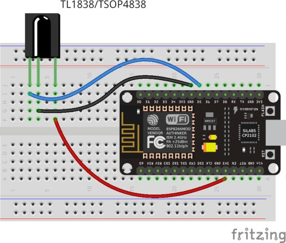
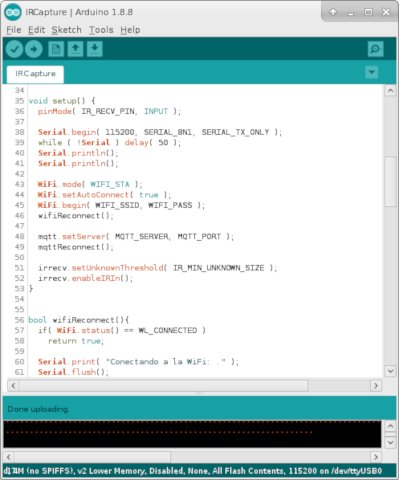
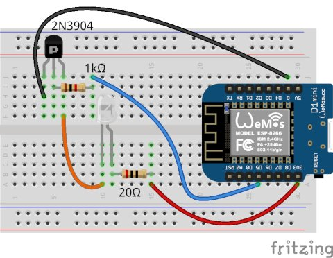
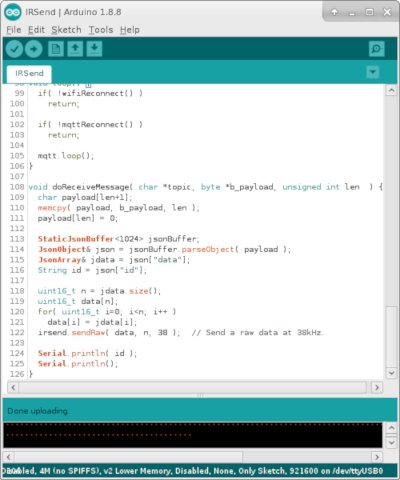
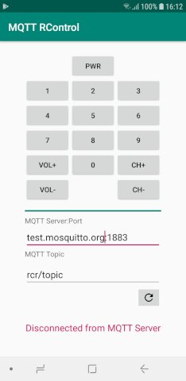

# MQTT KeyPad
A simple MQTT keypad

## Example: control an IR device using MQTT

1. Capture IR codes with an ESP8266 and send it to an MQTT Server (and save the IR codes to use in a Python script)

    
    

2. Send IR codes to your devices using an MQTT Server

    
    

3. Control your IR devices with this simple app and the Test.py script

    
